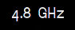
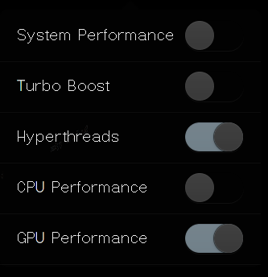

# Wingpanel Powersave indicator
wingpanel-indicator-powersave is a user-discretion power management utility, serving as a front-end to [throttlectl](https://github.com/quequotion/pantheon-qq/tree/master/throttlectl), a command-line user-discretion power management utility written in bash.

---

  
#### Popover
  

## Building and Installation

### For Debian and derivatives (Ubuntu, elementary OS, etc):

#### You'll need the following dependencies:
* libgranite-dev
* libpolkit-gobject-1-dev
* libglib2.0-dev
* libgtk-3-dev
* libwingpanel-dev
* policykit-1
* meson
* valac

#### How to build
    git clone https://github.com/quequotion/wingpanel-indicator-powersave.git
    cd wingpanel-indicator-powersave/
    meson build --prefix=/usr
    ninja -C build
    sudo ninja -C build install

### For Archlinux and derivatives (Manjaro, Artix, etc)

A package is available in the AUR: [wingpanel-indicator-powersave-git](https://aur.archlinux.org/wingpanel-indicator-powersave-git).

See the comments for instructions on building it without an AUR helper.
